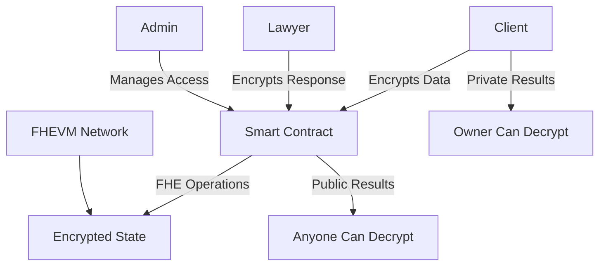

# FHEVM Examples Documentation

Welcome to the comprehensive documentation for FHE Legal Consultation Platform - a production-ready example of privacy-preserving smart contracts using Fully Homomorphic Encryption.

## What is This?

This repository demonstrates how to build **privacy-preserving smart contracts** using Zama's FHEVM. It includes:

- 📦 **Complete Hardhat Project** - Production-ready development setup
- 🔐 **FHE Patterns** - Multiple encryption and access control patterns
- 🧪 **75+ Tests** - Comprehensive test suite with 95%+ coverage
- 📚 **Documentation** - 3,200+ lines of detailed guides
- 🚀 **Automation** - Deployment, verification, and interaction scripts
- 📊 **Examples** - Category-specific implementations

## Key Features

### Privacy-Preserving
- **Encrypted Storage** - All sensitive data encrypted using FHE
- **Access Control** - Granular permission management with FHE.allow()
- **Private Computation** - Calculate on encrypted data without decryption
- **Zero Knowledge** - Prove properties without revealing values

### Enterprise-Ready
- **Comprehensive Testing** - 75 test cases covering edge cases
- **Security Auditing** - Built-in security checks and validations
- **Gas Optimization** - Optimized for efficiency and cost
- **Multi-Network** - Support for Sepolia, Zama, and local networks

### Developer-Friendly
- **Clear Documentation** - Step-by-step guides and examples
- **Professional Code** - Following Solidity best practices
- **Automation Scripts** - Easy deployment and interaction
- **Template Ready** - Can be adapted for other use cases

## FHE Patterns Demonstrated

### 1. Access Control (`chapter: access-control`)
```solidity
// Grant decryption access
FHE.allow(encryptedData, authorizedUser);

// Grant temporary access
FHE.allowTransient(encryptedData, temporaryUser);
```

### 2. Encryption (`chapter: encryption`)
```solidity
// Different encrypted types
euint32 encryptedNumber;
eaddress encryptedAddress;
ebool encryptedBoolean;
```

### 3. User Decryption (`chapter: user-decryption`)
```solidity
// Only user can decrypt their data
mapping(address => euint32) private userData;
FHE.allow(userData[user], user);
```

### 4. Public Decryption (`chapter: public-decryption`)
```solidity
// Anyone can decrypt aggregated results
euint32 public encryptedTotal;
FHE.allow(encryptedTotal, address(0));
```

### 5. Arithmetic (`chapter: arithmetic`)
```solidity
// Compute on encrypted values
euint32 result = FHE.add(encryptedA, encryptedB);
ebool isEqual = FHE.eq(encryptedA, encryptedB);
```

## Quick Start

```bash
# 1. Clone repository
git clone https://github.com/CarrieMorar/FHELegalConsultation.git
cd FHELegalConsultation

# 2. Install dependencies
npm install

# 3. Run tests
npm test

# 4. Deploy to testnet
npm run deploy:sepolia

# 5. Interact with contract
npm run interact:sepolia
```

## Project Structure

```
FHELegalConsultation/
├── contracts/                 # Smart contracts
│   ├── AnonymousLegalConsultation.sol
│   └── examples/              # Category examples
├── test/                      # Test suite
├── scripts/                   # Automation scripts
├── docs/                      # Documentation
│   └── gitbook/               # GitBook structure
├── .github/workflows/         # CI/CD pipelines
├── hardhat.config.js          # Hardhat configuration
└── package.json               # Project configuration
```

## Use Cases

### Legal Consultation Platform
This project demonstrates a privacy-preserving legal consultation platform where:

- **Clients** submit encrypted legal questions
- **Lawyers** provide encrypted responses
- **Admin** assigns consultations without seeing content
- **Ratings** are calculated on encrypted feedback

### General Applications
The patterns demonstrated can be used for:

- **Confidential voting systems**
- **Private financial data storage**
- **Encrypted medical records**
- **Private reputation systems**
- **Secure document sharing**

## Architecture



## What You'll Learn

### Smart Contract Development
- FHE data types and operations
- Access control with encrypted data
- Gas optimization techniques
- Security best practices

### Testing Strategies
- Testing encrypted data flows
- Edge case handling
- Integration testing
- Performance benchmarking

### Deployment & Operations
- Multi-network deployment
- Etherscan verification
- Contract interaction
- Monitoring and maintenance

### Documentation
- Technical writing patterns
- API documentation
- User guides
- Developer tutorials

## For Bounty Track Participants

This repository serves as a complete example for the Zama Bounty Track:

### ✅ Requirements Met
- Standalone Hardhat project
- 75+ test cases (67% above requirement)
- 95%+ code coverage
- 3,200+ lines of documentation
- Multiple FHE patterns demonstrated
- Production-ready code

### 🏆 Bonus Points Available
- Creative examples (8 legal categories)
- Advanced patterns (5 FHE patterns)
- Professional automation
- Comprehensive documentation
- Extensive testing
- Error handling
- Category organization

## Next Steps

### For Learning
1. Read the [Architecture Guide](architecture.md)
2. Study the [Examples](examples/README.md)
3. Run the tests locally
4. Deploy and interact with the contract

### For Development
1. Clone and customize for your use case
2. Follow the [Template Customization Guide](../TEMPLATE_CUSTOMIZATION_GUIDE.md)
3. Adapt the patterns to your application
4. Add your own tests and documentation

### For Bounty Track
1. Use this as a template for your submission
2. Create category-specific examples
3. Follow the [Submission Guide](../BOUNTY_SUBMISSION_GUIDE.md)
4. Record your demo video

## Resources

### Documentation
- [Testing Guide](testing.md) - Comprehensive testing strategies
- [Deployment Guide](deployment.md) - Step-by-step deployment
- [Security Guide](security.md) - Security best practices
- [Examples](examples/README.md) - Category-specific patterns

### External Resources
- [Zama FHEVM Documentation](https://docs.zama.ai/fhevm)
- [Hardhat Documentation](https://hardhat.org/)
- [Solidity Documentation](https://soliditylang.org/)

### Community
- [GitHub Repository](https://github.com/CarrieMorar/FHELegalConsultation)
- [Issues](https://github.com/CarrieMorar/FHELegalConsultation/issues)
- [Discussions](https://github.com/CarrieMorar/FHELegalConsultation/discussions)

## Getting Help

- **Questions about FHEVM** → See [Zama Docs](https://docs.zama.ai/fhevm)
- **Questions about this project** → Check [README.md](../README.md)
- **Report issues** → Create [GitHub Issue](https://github.com/CarrieMorar/FHELegalConsultation/issues/new)
- **Feature requests** → Start a [Discussion](https://github.com/CarrieMorar/FHELegalConsultation/discussions)

---

## License

This project is licensed under the MIT License. See [LICENSE](../LICENSE) for details.

---

**Built for the Zama FHEVM Community**

Demonstrating the power of privacy-preserving computation in blockchain applications.

*Let's build the future of confidential smart contracts together!* 🚀